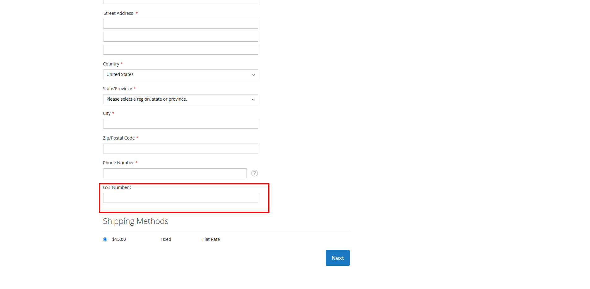

# magento2-gst-custom-checkout-field
Magento2 Checkout Page Custom Field - GST Number


## Supports

- <b>Supports : Magento 2.3.x and 2.4.x</b>

Required to run the following commands in Magento 2 root folder:

```
php bin/magento setup:upgrade
php bin/magento setup:static-content:deploy
php bin/magento cache:clean
```

### Install via zip

* [Download the latest version from GitHub](https://github.com/vrajeshpatel4u/magento2-gst-custom-checkout-field.git)

## Enable Custom Field (GST Number) On Checkout Page

Admin Panel -> Stores -> Settings -> Configuration -> V4U -> GST Number Configuration -> Yes -> Save

### Custom Filed (GST Number) On Checkout Page 


